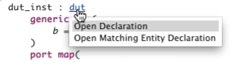

In Sigasi, you can always jump to the declaration of any identifier. This is useful if you want to read how the identifier was defined, or if you want to change the declaration. Note that you can also [code-comprehension-without-clicking-your-mouse-hovering] over an identifier to see the declaration.

## Keyboard shortcut: F3

The first way to jump to a declaration is to place your cursor over the identifier and then press **F3**. This will open the declaration in the editor. If the declaration is in another file, that file file opens up in a new editor tab.

## Ctrl + Click

You can jump to a declaration by holding the *Ctrl* key and clicking on the identifier. When you hold the *Ctrl* key and you place your mouse over an identifier, the identifier is colored in blue and underlined.

Sometimes, there is more than one target, for instance in a component instantiation you can jump to the component declaration or to the corresponding entity. In this case, the different options are shown when you press **Ctrl** and place your mouse over the identifier.

## Context menu

Instead of pressing **F3**, you could also right-click the identifier and select *Open Declaration*. If you are clicking on a component or on the generics or ports of a component, you can also select **Open Matching Entity**. For people who prefer the mouse over the keyboard.

