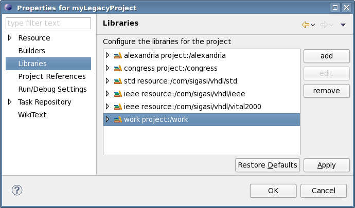

***Note** This article was originally written for Sigasi 1.0. The
general concepts still apply, but you will need to change some details.
[Let us know](mailto:support@sigasi.com) if you need more help with
this.*

This post explains how to import legacy projects into Sigasi HDT. I
explain a technique that allows any project organization, even the most
chaotic (as legacy projects tend to be) with source files scattered
across your hard drive (or drives).

I need to thank Jan-Willem Weijers from IMEC for pointing out this
method of work to me.

We will use the
<a href="http://help.eclipse.org/helios/index.jsp?topic=/org.eclipse.platform.doc.user/concepts/virtualfolders.htm">Virtual Folders</a>, which were introduced in Eclipse 3.6 "Helios". Using
virtual folders, we can organize files into projects, independent of how
those files are organized on the hard drive.

Let's assume you have a legacy project with VHDL files in three
different libraries. If you're not sure what VHDL libraries are, you
probably have only one library: "work".

# Creating virtual folders
First, you create a new, empty project. <strong>File &gt; New &gt; VHDL Project</strong>

Let's suppose that we have three libraries: work, congress and alexandria. If you don't use libraries to organize your VHDL code, just create a virtual folder "work".
For each library you want to use, create a virtual folder with the name
of that library. Click <strong>New &gt; Folder</strong>. Then click
<strong>Advanced</strong> and select <strong>Folder is not located on
the file system (Virtual Folder)</strong>. Type the folder name (which
corresponds to one of your library names) and press
<strong>Finish</strong>.

# Map each virtual folder to a library

In the project explorer, the name of the library is displayed next to
each folder. You can see that each folder is still mapped to the work
library. We now need to change this mapping, so that each folder is
mapped to the correct library.

Open <strong>Project &gt; Properties &gt; Libraries</strong>. Now remove
the old mapping for the work library, and add a new library mapping for
each library. Library work maps to project:/work.

# Adding the project files

Now comes the fun part. To add files to your newly created virtual
folders, you just drag them from your file system to your virtual
folder. This works in Windows, in Gnome (Linux) and in Mac OS X. For
now, drag and drop does not work from Konqueror (KDE/Linux).

After you drag and drop a file, Eclipse will ask if you want to use a
relative file path. For legacy projects, you may want to use absolute
path names. In this case, uncheck the box in the Link Files dialog.

You now have a VHDL project that consists entirely of virtual folders
and virtual files. You can have several projects that share some or all
VHDL files in the most flexible way.

We'd love to hear how you organize your projects. Talk to us in the comments section.
