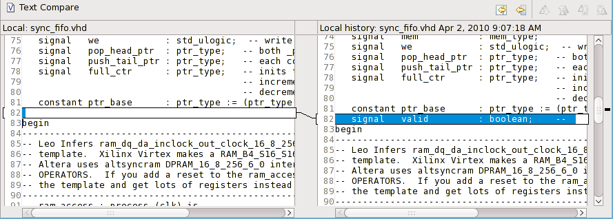

In Sigasi HDT for VHDL, as in any other Eclipse plugin tools, you can
easily compare your current file with older versions. There are two
methods for doing this: a side-by-side graphical diff, or a quick diff,
which is directly available inside your editor.

## Quick diff

To the left of your editor view, you can see colored markers on the
lines that have been changed since you last saved your file. (if you
have line numbers enabled, the line number will be colored). If you
hover your mouse over the colored part, you see what that line looks
like on the copy on your hard drive.

Instead of comparing your VHDL code to the version saved on disk, you
can also compare to the your version control system (I like that
better). Set the options for quick diff (or turn it off) at:
**Window > Preferences > General > Editors > Text Editors > Quick Diff**

## Compare

You can also see a side-by-side diff of your code by right-clicking in
the editor and then selecting <strong>Compare With</strong>. You can
compare with

* Local history
* Any revision from your version control system

The local history is especially useful if you have made a lot of edits,
but have not committed intermediate version to your version control
system.

