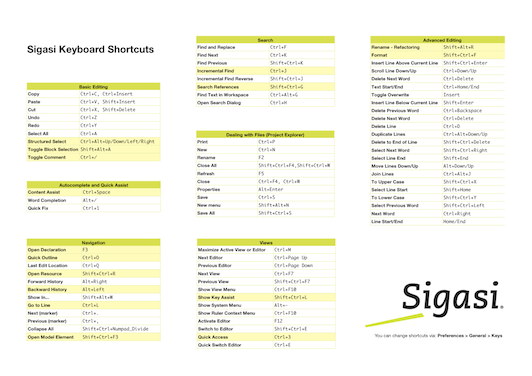

I created a new cheat sheet with the most important **keyboard shortcuts** you should know when working with Sigasi. I marked my favorites with a yellow background. 

A great way to boost your productivity even more.

## Update 2018-11

The keyboard shortcuts cheat sheet was updated to the latest version.
