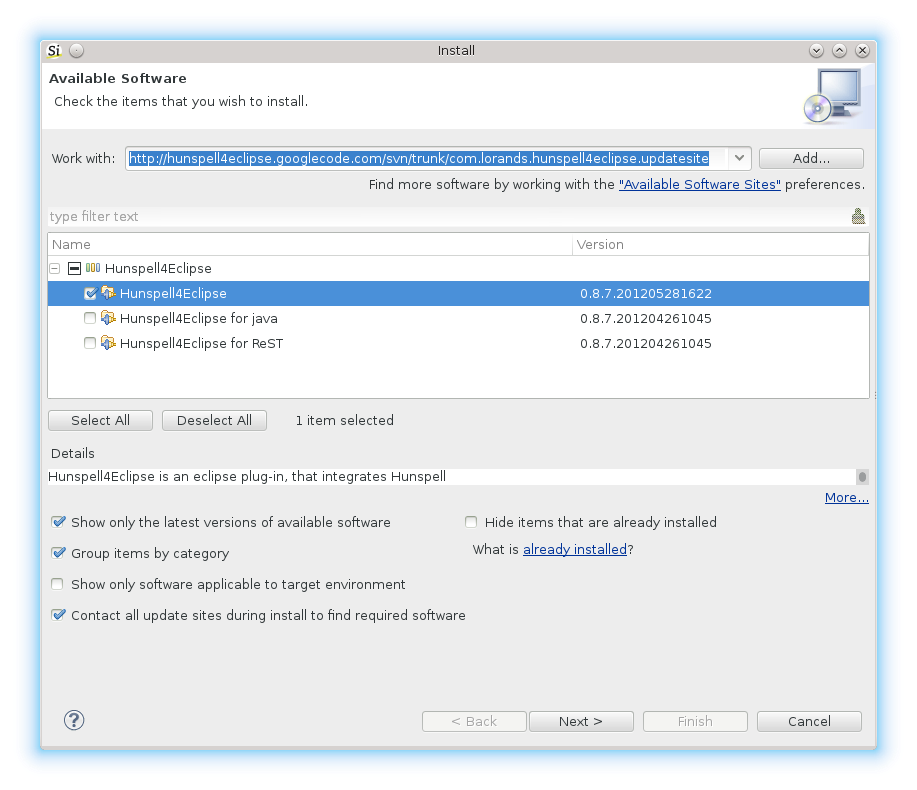

Sigasi supports spelling checking in comments and strings, but you need to **install a spell checking plugin** first. Next you need to **download** and **configure** a **dictionary** for your language.

## Install Hunspell4Eclipse

Install the [Hunspell4Eclipse}(http://code.google.com/p/hunspell4eclipse) plugin:

1. **Help > Install New Software ...**
2. Enter this update site: <http://hunspell4eclipse.googlecode.com/svn/trunk/com.lorands.hunspell4eclipse.updatesite> and press **enter**
3. Select **Hunspell4Eclipse > Hunspell4Eclipse**
4. Click **Next >** and **Finish**, and restart Sigasi

## Install Dictionary

The Hunspell plugin does not include any bundled dictionaries. You need to install dictionaries separately.

You can download good dictionaries from the OpenOffice.org project, which also uses the Hunspell engine. There is a list of available dictionaries at <http://extensions.services.openoffice.org/>.

The file you downloaded will have an `.oxt` extension. If you rename this extension to `.zip`, you can unzip it. You need the `.dic` and `.aff` files for your language (e.g. `en_US.aff` and `en_US.dic` for **American English**). Copy these files to a safe location (the dictionary file path).

## Configure the Dictionary

Open the Spelling preference page:
**Window > Preferences > General > Editors > Text Editors > Spelling**
Next, enter the dictionary file path.
