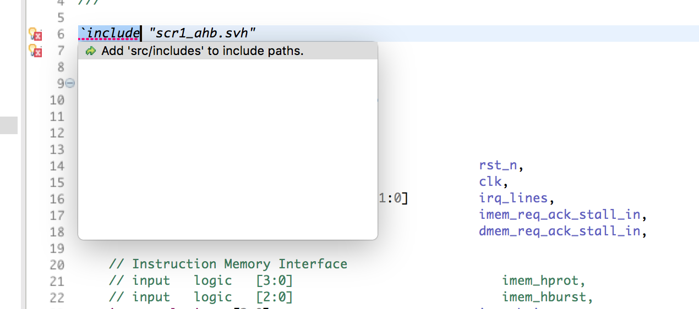

Setting up a SystemVerilog project in Sigasi Studio is easy. First you add all your source files. Next you configure the include paths, and you're ready to go.

Sigasi Studio follows the Eclipse approach in setting up projects. This means that there is a lot of flexibility, but in most cases it is a matter of pointing Sigasi Studio to the correct source folder. If you want to exclude some SystemVerilog source files from your project, right click on the source files and select *Exclude from build* (This also works for folders).

If you are using Verilog Preprocessor includes, and the include files are not next to your source files, you also have to set *include paths*. The most convenient way to configure this, is with a *Quick Fix*: Open the source file with the `` `include`` directive, click on the error marker, and select the suggested fix.

# Example: Opening the SCR1, open-source RISC-V project from GitHub

To demonstrate how easy this is, I will guide you through opening the [SCR1 project](https://github.com/syntacore/scr1/tree/47a47a66c1f29b86103598e68883aeb2786b38a2) in Sigasi Studio. SCR1 is an open-source RISC-V compatible MCU core, designed by Syntacore.

## Importing a checked-out version of the project

If you already have cloned the project on your computer, follow these steps:

1. Select **File > Open Project from File System...**, click **Directory...** and browse to the location of the source files (in my case this is `/Users/heeckhau/git/scr1`).

2. Click **Finish**
3. Open any SystemVerilog source file (e.g. `src/scr1_memory_tb_ahb.sv`) and confirm that you want to add *Sigasi's (System)Verilog support* to the project.

4. Click on the error marker (with the light bulb decorator) next to the \`include directive and select *Add 'src/includes' to include paths.*.

## Clone the project using the Git plugin

Sigasi Studio offers [Git](https://git-scm.com/) support via the [EGit plugin](http://www.eclipse.org/egit/). This way you can also clone the sources inside the tool itself:

1. Click **File > Import...**
2. Next inside the **Git** category select **Projects from Git** and click **Next**
3. Select **Clone URI** and click **Next**
4. Paste the git repo location `https://github.com/syntacore/scr1.git` in the **URI:** field and click **Next**
5. Select the **master** branch and click **Next**
6. Select the local destination for the cloned source 
7. Select **Import as generic project**
8. Confirm the project name
9. Click **Finish**
10. Follow steps 3-5 from the list above

## Remarks

* Sigasi Studio treats SystemVerilog include files as regular SystemVerilog code by taking the *'including' context* into account. This requires no extra setup or configuration from your part.
* The project information is stored in:
    * The `.project` file, it describes which files belong to the project
    * The `.library_mapping.xml` file, it describes the project's library information (and excluded files)
    * All other project settings are stored in the `.settings` folder
