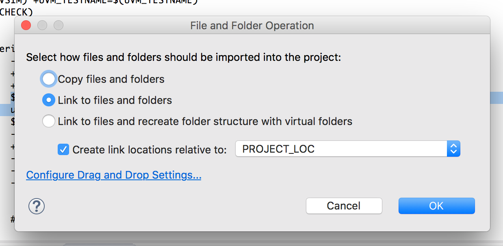
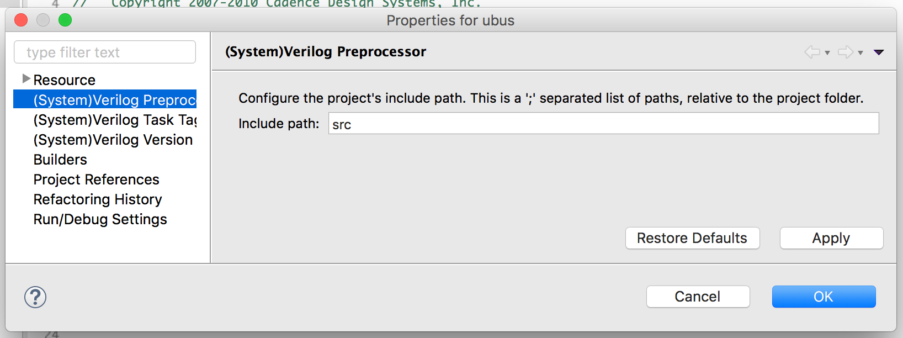

[Setting up a regular SystemVerilog project in Sigasi Studio is easy][/tech/systemverilog-project-demo]. As UVM, the [Universal Verification Methodology](https://en.wikipedia.org/wiki/Universal_Verification_Methodology), complicates everything, it also complicates project setup in Sigasi Studio. In this blog post I will demonstrate how to use UVM in a Sigasi project.

As an example I will show how to open the UBUS project that is shipped with the [reference implementation of UVM](http://www.accellera.org/downloads/standards/uvm) in Sigasi Studio.

The procedure consists of 9 simple steps:

1. Download the [reference implementation of UVM](http://www.accellera.org/images/downloads/standards/uvm/uvm-1.2.tar.gz)
2. Unpack the sources on your disk (e.g. to `/Users/heeckhau/demo/uvm-1.2`)
3. Import the UBUS sources in Sigasi:
    1. Select **File > Open Project from File System...**, click **Directory...** and browse to the location of the UBUS source files (in my case this is `/Users/heeckhau/demo/uvm-1.2/examples/integrated/ubus`).
    2. Click **Finish**
4. Right click the project (`ubus`), and select **Configure > Add (System)Verilog support**
5. Use your files system explorer (Windows Explorer, Finder, Nautilus) and navigate to the UVM sources (in my case this is `/Users/heeckhau/demo/uvm-1.2/src/`) and *drag and drop* this folder into the **`Common Libraries`** folder[^commonLibraries] of the `ubus` project.  
  Select **Link to file and folders** and **OK**
  
6. Add the `uvm` sources to the build: right click on `Common Libraries/src/` and select **Add to build (library work)**  
7. Add the UVM sources to the include path: right click the project and select **Properties > (System)Verilog include path**; enter `Common Libraris/src` as include path and confirm with **OK**.
  
8. Open `examples/ubus_tb_top.sv` by double clicking the file in the project explorer. Notice the error markers on the `` `include``s.
9. Click on the error marker in the margin (with the small light bulb) and select **Add sv to include paths**. This automatically adds the `sv` folder to the include paths.

Your Sigasi Studio UVM project is now ready for use. Feel free to experiment with *hovers*, *open declaration (**F3**)*, *find references* and *autocomplete* (**Ctrl+Space**).

Footnotes:
[^commonLibraries]: We recommend to add the UVM sources to the `Common Libraries` folder, because sources in this folder are treated as read-only library files. These files are not checked for errors and are not send to external compilers for analysis [More info](/manual/libraries#libraries-common).
