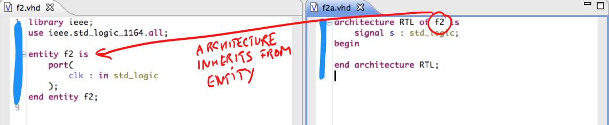
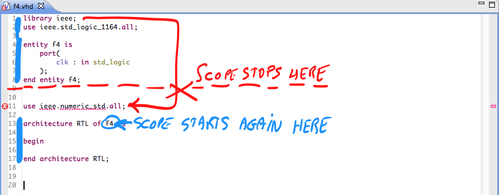

Beginning VHDL engineers, and advanced engineers too, can get confused about the exact scope of a _use clause_ and a _library clause_ in VHDL. They usually show up at the top of a file, which would make you think that they are visible in the entire file. Unfortunately, the truth is a bit more complex. 

First a small disclaimer: we've read the VHDL Language Reference Manual more thoroughly than 99.99% of  all engineers you are ever going to meet (and more than what will make even a die-hard language geek happy). Still, it is a heavy document and the language tends to be unambiguous only after you have understood what it means. We've tested our assumptions against some common industry standard simulators to confirm our findings. However, the VHDL language, the simulators and this article were all made by man. So you might still find an error somewhere. 

## Use clause' scope is the file?

That said: a first example shows a file with an entity and its architecture. The VHDL datatype `std_logic` is declared in `ieee.std_logic_1164`, and so a _use clause_ at the top of the file makes the datatype visible for later reuse. Above the _use clause_, we need a _library_ clause so that the compile would know that the word `ieee` is a library name. It would be reasonable, but incorrect, to assume that the _scope_ (the range of places where its effects can be seen) of the use clause is the entire file.

## First counterexample: the use clause spans multiple files?

As a first counterexample, we show another oft-used construct: an entity and its architecture in two separate files. Here, it seems that the architecture seems to "inherit" the use clauses from its entity! In fact, the VHDL standard says that a "secondary unit" gets the same context as the corresponding "primary unit". So: architectures inherit the use clauses and library clauses from their entities, and a _package body_ inherits from its _package_ declaration.

## Second counterexample: the use clause does not span the entire file?

The second counterexamples confirms that an architecture inherits use clauses from their architectures. The architectures that correspond to the entity at the top of the file inherit the context. The final design unit (entity `f3_`) does not know about the use clauses, and so you see an error here.

## Special exception

So we know that the _VHDL secondary unit_ (architecture or package body) inherits the context from the primary unit (entity), but we need to make an important nuance. An architecture's _context clause_ is the part before the word "architecture" that can contains library clauses or use clauses. This context clause is not part of the architecture itself, and so it does not inherit the context of the entity.

This may seem confusing, and it is. 

The historical reason for such strange behavior is that the VHDL and ADA languages were designed for ancient "one-pass" compilers. These compilers processed a file in a single pass, without looking forward and without going back. When the compiler processes a context clause, it does not yet know to which architecture this context clause will belong to. So it does not yet know which entity's context it should load. 

## Conclusion

There is lots more to be said about scoping, especially inside a _VHDL configuration_. But we'll save that story for another time. 
This article covered some cases that you are likely to encounter the first three examples in real life. Now that you know how scoping rules work for VHDL architectures and VHDL package bodies, you are less likely to get bitten by your compiler.

Admittedly, the last "special exception" does not have any major impact on your work as a hardware designer. But it is a cool piece of useless knowledge that you can use during job interviews or at the annual company barbecue.