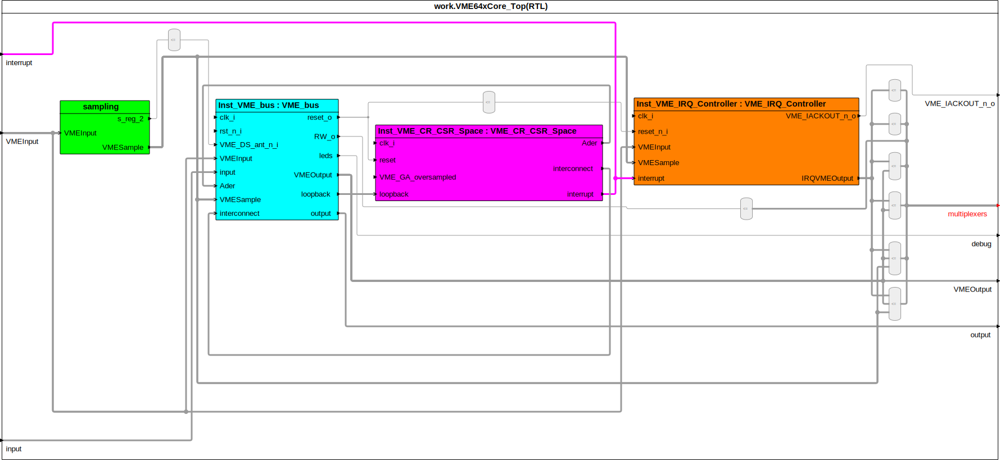
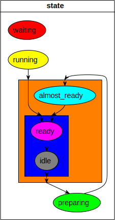

The BlockDiagram- and StateMachine view have been present for quite some time in Sigasi XL-Doc, but sometimes it just doesn't cut it.
The diagrams are too complex and crowded to allow you to easily understand a design.
For this reason, it also can't be used in documentation.
But as some of you might know, we've been prototyping a solution for this problem for a couple of months.

In this blog I will tell you about (the usage) of the GraphicsConfiguration Domain Specific Language (DSL).
It's a novel way to filter down your diagrams and make them usable for documentation and design exploration.
It will also stay in sync with your code, unlike comments and externally associated diagrams.

## What is it
The DSL is a plain text file containing a few declarations and configurations, which when executed, results in grouping, filtering and coloring of the diagram.
You can see it in action in the images below:

This BlockDiagram  
  
Turns into:  
  

This StateMachine  
  
Turns into:  
  

A plain text format was chosen over a buttons and menus for several reasons:
* It can easily be managed with your version control system
* It's easy to debug by yourself, unlike proprietary formats or UIs
* We can support you using all of our well-known features such as auto-complete, validations, formatting,...
* It's lightweight and can be used as the basis for the UI implementation

## How do I get started
To get started, choose a design with a BlockDiagram or StateMachine you want to simplify.

Create a new DSL file by going to **File>New>Graphics File**.

From there on you can declare groups and configure your diagram, check it in to version control and share it with your colleagues.
The auto-complete (Ctrl+Space) should help you write most of the code while formatting (Shift+Ctrl+F) will keep your file clean.
If you're interested in the DSL's exact syntax, you can find it [here](graphics.ebnf.html).

## What can I do
The DSL features:
* Grouping
* Hiding
* Block collapsing
* Coloring
* Regex matching
Do note that in the BlockDiagram you can group blocks and wires while in the StateMachine you can only group states.

Sigasi features:
* Auto-complete (Ctrl+Space)
* Formatting (Shift+Ctrl+F)
* Show in BlockDiagram/StateMachine (on right of an identifier, to show it in the diagram)
* Double-click on a diagram element to navigate to it in the code
* Navigate to declaration (Ctrl+click or F3 on identifier)

## Show me!
### BlockDiagram
To demonstrate the power of the new DSL we will make use of an existing open-source project, [VME64x core](https://www.ohwr.org/projects/vme64x-core).
You can clone the [repository](git://ohwr.org/hdl-core-lib/vme64x-core.git) and download the DSL file [here](TODO).

The diagram we are going to filter down is the one associated with the architecture `RTL` that implements the entity `VME64xCore_Top`.
We express this on the first line using `diagram work.VME64xCore_Top.RTL`.
The file is then read from bottom to top. First you define all the groups then you start configuring the diagram.

We then start grouping away, first grouping all of the blocks that end in `nputSample`, and then creating a bunch of busses.
The syntax for a group is as follows `def Type group ID (Identifiers)` where `Type` is `block` or `wire`.
`ID` is the new name of the group and `Identifiers` is a comma separated list of existing `ID`s (DSL or VHDL) or a regex.
The syntax for a regex is `regex"regex_pattern"`. This uses [Java regexes](https://docs.oracle.com/javase/8/docs/api/java/util/regex/Pattern.html), you can also find a cheat sheet [here](http://files.zeroturnaround.com/pdf/zt_regular-expressions-cheat-sheet.pdf).

Following this, we configure the leftover blocks, wires and ports as well as the block groups and busses we just created.
The syntax for a configuration block is as follows: `Type Identifiers { ConfigurationItem* }` where `Type` is `block, wire` or `port`.
The syntax for a ConfigurationItem is as follows: `hide | collapse | color GraphicsColor`. You can discover which colors are available [here](graphics.ebnf.html) or through autocomplete.

Note that the DSL can not see everything, it can not see blocks, wires or ports that are within a another block.
To color our new group, `sampling`, green and hide it's internals we can write `block sampling { color green collapse }`.
However we can't type `block WRITEinputSample { color red }`. To access a block within a block, we have to nest configurations as follows:
```
block sampling {
    color green
    block WRITEinputSample {
        color red
    }
}
```

Configurations are also not cascading (unlike CSS), otherwise coloring our `sampling` block green, would turn all it's internal blocks green as well.

You're not able to group ports as we have not found a good use case for it yet (however if you find one let us know!), but grouped ports are created when you group wires into a bus.
You can also configure lone ports e.g. `port clk_i { hide }`

### StateMachine
StateMachines are just like the BlockDiagrams above, except the only `Type` that can be used is `state`.
The header is also slightly different, the syntax is as follows: `statemachine architecture : state_variable`.
For an example you can check out `4_state_machines.vhd` (in our VHDL Tutorial) with [this](TODO) filter file.

## Things to remember
* The file extension is important so leave it as is (.blockdiagram or .statemachine)
* The syntax dictates a fixed order, first define your groups, then start configuring the diagram
* The regexes are Java regexes
* There is no cascading
* StateMachine's only `Type` is `state` while BlockDiagram's `Type` contains `block, wire` and `port`.
* If you want to match pattern X and Y, use regex pattern `(?=X)Y`
* If you want to match pattern X or Y, use regex pattern `(X|Y)`

