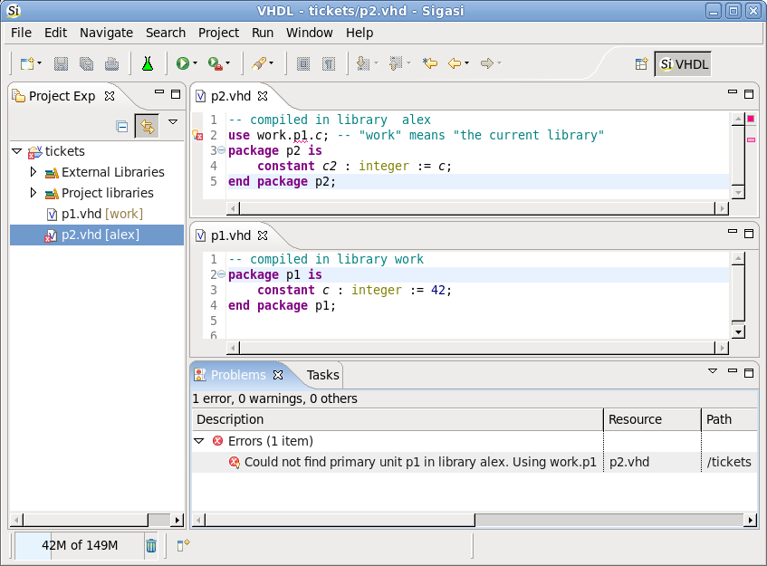

WORK is not the name of a VHDL library. This may surprise some (or even most) VHDL designers, even experienced engineers. Most of the time, nobody gets bothered by this. But on occasion, it can cause great confusion and waste of time.

All knowledge about VHDL starts with the IEEE Standard VHDL Language Reference Manual. LRM for short. Not much is said about "WORK", but in section 11.2 (in the LRM 1076-2000) you can read the following:

> Every design unit \[...\] is assumed to contain the following implicit context items \[...\]:
> `library STD, WORK; use STD.STANDARD.all;`
> \[...\] Library logical name WORK denotes the current working library during a given analysis.

Let me repeat: <strong>WORK denotes the current working library.</strong> 

This means that there is no library named WORK. Instead, the identifier WORK just refers to the current library. You can compare WORK with the Java concept of <code>this</code>. In Java <code>this</code> refers to <em>this</em> object, which obviously is different for each object. This makes me think of a silly joke of man who asks: "is this the second street to the right?"

Enough silliness. Much confusion comes from the fact that VHDL tools allow you to give the name "WORK" to a library:
```
vlib work
vcom -work work myfile.vhd
```



That is as crazy as having a street address of <em>John Doe, Ourstreet, MyHomeTown</em>. How will your mail ever get there? And that is exactly the problem with using WORK as a library name. Other libraries cannot refer to you. If another library (say <code>alex</code>) they would refer to <code>work.yourpackage.all</code>, the VHDL analyser would read this as the <code>alex.yourpackage.all</code>.

It would have been better if VHDL tools would refuse the explicit name of WORK for a library. It would have been better if WORK were a reserved keyword in VHDL. But hey, there is no way to change that now. The best you can do is be aware of this idiosyncrasy in VHDL and live with it. Preferably by avoiding WORK all together.

