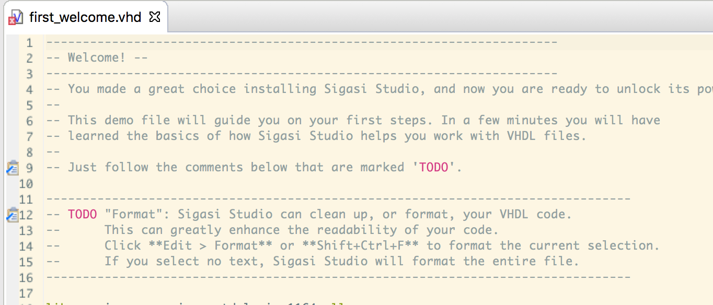

The best way to get started with Sigasi Studio is to go through the interactive tutorial.

In the **standalone version** of Sigasi Studio _both the VHDL and Verilog tutorials are opened by default_. **Plugin users** can start the tutorial by clicking **File > New Example...**. The VHDL tutorials are in the **VHDL examples** category. The Verilog tutorials are in the **Verilog examples** category.

The tutorial instructions are embedded as `comments` in the source files, just follow the `TODO` tags.

